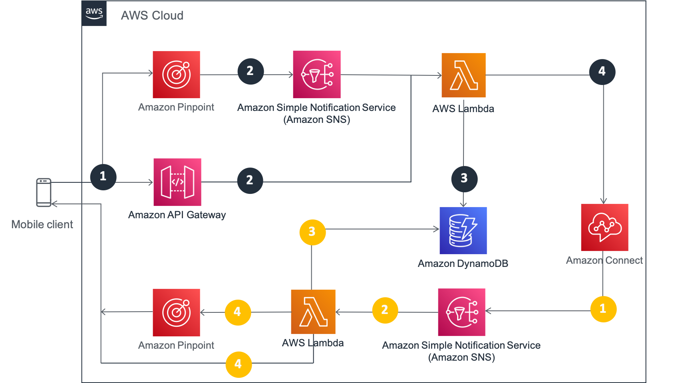

# Message streaming API starter projects

## Prerequisite

### General

- Create a simple contact flow which routes the contact to the appropriate queue.
- (You can use the sample contact flow for this example.)
- [An Amazon Connect Instance](https://docs.aws.amazon.com/connect/latest/adminguide/amazon-connect-instances.html)
- [An Amazon Connect Contact Flow setup for Amazon Connect (including Disconnect flow) ](https://docs.aws.amazon.com/connect/latest/adminguide/chat.html#example-chat-scenario)
- [AWS CLI setup in your local environment](https://docs.aws.amazon.com/cli/latest/userguide/install-cliv2.html)

### SMS

For detailed steps please visit the [blog](https://aws.amazon.com/blogs/contact-center/building-personalized-customer-experiences-over-sms-through-amazon-connect/)

### FB

Please refer to [this blog](https://aws.amazon.com/blogs/contact-center/adding-digital-messaging-channels-to-your-amazon-connect-contact-center/) on the steps to create a Facebook messenger channel.

## Install AWS CDK

`npm -g install typescript`
`npm install -g aws-cdk`

`cdk bootstrap aws://ACCOUNT_ID/AWS_REGION`

## Deployment commands

- `npm install`

- `cd src/lambda/inboundMessageHandler`

- `npm install`

- `cd ../../..`

- `cd src/lambda/outboundMessageHandler`

- `npm install`

- `cd ../../..`

- `cd src/lambda/digitalChannelHealthCheck`

- `npm install`

- `cd ../../..`

- CDK deploy using your CLI profile (if you use default profile, don't need to specify the profile flag). Pass in the context required for the cdk stack.
  - If you are deploying SMS channel you need to supply the `pinpointAppId` and `smsNumber` variables.
  - If you are deploying the Facebook channel you need to supply the `fbSecretArn` variable.

### Deploy SMS channel only

```bash
cdk deploy \
--context amazonConnectArn=<YOUR INSTANCE ARN> \
--context contactFlowId=<YOUR CONTACT FLOW ID>  \
--context smsNumber=<YOUR SMS NUMBER IN e164 format> \
--context pinpointAppId=<YOUR PINPOINT APP ID>
```

### Deploy FB Channel only

```bash
cdk deploy \
--context amazonConnectArn=<YOUR INSTANCE ARN> \
--context contactFlowId=<YOUR CONTACT FLOW ID>  \
--context fbSecretArn=<YOUR FB SECRET ARN>
```

### Deploy BOTH SMS and FB channel

```bash
cdk deploy \
--context amazonConnectArn=<YOUR INSTANCE ARN> \
--context contactFlowId=<YOUR CONTACT FLOW ID>  \
--context smsNumber=<YOUR SMS NUMBER IN e164 format> \
--context pinpointAppId=<YOUR PINPOINT APP ID> \
--context fbSecretArn=<YOUR FB SECRET ARN>
```

## Architecture



### Customer chat path

1. Customer starts chat/sends message
2. Chat message is delivered through Amazon Pinpoint (SMS message) or Amazon API Gateway (digital channels such as Facebook messenger).
3. AWS Lambda records the chat session context in Amazon DynamoDB
4. AWS Lambda sends the chat message to Amazon Connect

### Agent chat path

1. Agent sends reply message
2. Chat message is delivered through Amazon Simple Notification Service to AWS Lambda
3. AWS Lambda looks up the chat session context in Amazon DynamoDB
4. AWS Lambda sends the chat message the source application directly through APIs (Facebook messenger) or Amazon Pinpoint (SMS message)

## Repository structure

### CDK

- `lib/chat-message-streaming-examples-stack.ts` is where your CDK application’s main stack is defined. The stack defines all the AWS infrastructure resources such as API Gateway, Dynamo DB, SNS and Lambda. The code for Lambda is defined in the `src/lambda` directory.
- `bin/chat-message-streaming-examples.ts` is the entrypoint of the CDK application. It will load the stack defined in `lib/chat-message-streaming-examples-stack.ts`.
- `package.json` is your npm module manifest. It includes information like the name of your app, version, dependencies and build scripts like “watch” and “build” (package-lock.json is maintained by npm)
- `cdk.json` tells the toolkit how to run your app.
- `tsconfig.json` your project’s typescript configuration
- `.gitignore` and `.npmignore` tell git and npm which files to include/exclude from source control and when publishing this module to the package manager.
- `node_modules` is maintained by npm and includes all your project’s dependencies.

### Lambda

The Lambda function code is defined in the `src/lambda` function. We have three Lambda functions

####`src/lambda/inboundMessageHandler`
This Lambda function is responsible for the intake of messages from a third party. The entry point will take messages from SNS/Pinpoint for the SMS channel and from API Gateway for Digital channels. Each integrated channel will have a channel handler in which the conversion from the 3rd party message format to a format that Amazon Connect expects will be performed. This Lambda is also responsible for starting new chat contacts in Amazon Connect and the orchistration of mapping a 3rd party chat to a chat in Amazon Connect. DynamoDB is used to store ContactID of the Amazon Connect chat, participant information from Amazon Connect, and the vendor's ID given to us by the third party. Any subsequent messages received from the 3rd party with the same vendor ID will be sent to the respective Amazon Connect chat as indicated in the DynamoDB table.

####`src/lambda/outboundMessageHandler`
This Lambda function is responsible for messages originating from Amazon Connect with the destination of a third party channel. The ContactID from the message will be used to look up the VendorID and the appropriate channel in DynamoDB. The message is then passed on to the appropriate channel handler for message transformation and invocation of the respective 3rd party API.

####`src/lambda/digitalChannelHealthCheck`
This Lambda function is used for digital channels that require a health check endpoint. Health checks come in from the API Gateway endpoint and are routed to the appropriate channel handler to respond to the third party with their expected payload.

We have defined a common file structure for lambda functions:

```
├── index.js // Lambda entry point
├── lib
│   ├── handlers
│   │   ├── <channel-name>.js messages // Channel handler(s)
│   │   └── ...
│   │   └── ...
│   │   └── ...
│   └── <inbound/outbound>Helper.js // Helper module
├── package-lock.json
└── package.json

```

## Video walkthrough

Please feel free to watch our webinar where we do a video walkthrough of the project.

[](https://www.youtube.com/watch?v=2_81YdVJbEw)


## Troubleshooting

### SDK errors 

If the method does not exist or you are getting other SDK errors, please check you are using the latest SDK which includes the [new APIs](https://docs.aws.amazon.com/connect/latest/adminguide/chat-message-streaming.html).

### Message not getting published to SNS

- Check the SNS resource based policy to check Amazon Connect service has permissions ( `sns:publish` ) to publish messages to it.

```json
{
  "Version": "2008-10-17",
  "Id": "__default_policy_ID",
  "Statement": [
    {
      "Sid": "__default_statement_ID",
      "Effect": "Allow",
      "Principal": {
        "Service": "connect.amazonaws.com"
      },
      "Action": ["SNS:Publish"],
      "Resource": "arn:aws:sns:us-west-2:xxxxxxxxxxxx:yyyyyyyy"
    }
  ]
}
```

- Check that your SNS topic is a standard topic not FIFO topic (CDK by default deploys with the standard topic)

### Contact flow execution not starting

When a user is using streaming API in place of websockets, they will need to send a connection acknowledgment event (synonymous to connecting to websocket) and only after that contact flow execution will begin. It is expected that customers will call CreateParticipantConnection after they have called StartContactStreaming API to mark “Customer” as connected. This will ensure messages are sent when customer has confirmed that they are ready to receive.

### Throttling Exception (HTTP Error Code : 429/TooManyRequests)

Default TPS imits applied – 5,8 and 2,5 for StartContactStreaming and StopContactStreaming respectively. These are soft limits and can be increased.

### CreateParticipantConnection API throwing exception when “ConnectParticipant” Boolean is passed as true

There are two scenario when this would fail. Either - Streaming is not enabled on the Chat or participant calling the CreateParticipantConnection API is not Customer.

### StartContact Streaming API throwing exception when providing correct SNS ARN

The SNS ARN is malformed, or has different region than the region of Connect Instance. Please note: You might also see error as there is hard limit of max 2 streaming endpoints per chat and you are trying to add more than that.


## FAQ

**1. How will bi-directional SMS via those API's render interactive messaging?**

  Out of the box SMS does not support the interactive messaging as it is plain text. Other digital channels such as FB has capability to support this (however, you would need to extend the starter project on github to achieve this).

**2. How can I structure my chat experience so that I identify that this message is 'SMS' channel?** 

  In the [InboundContactHandler Lambda function on line 164](https://github.com/amazon-connect/amazon-connect-message-streaming-examples/blob/main/src/lambda/inboundMessageHandler/lib/inboundHelper.js#L164), when the StartChatContact is invoked, channel is passed through as a contact attribute. In the contact flow you can check via the contact attribute `chatframework_Channel`

**3. Which account to use for logging into Facebook developer account?**

  We suggest you to use an existing Facebook account for testing purposes.
  
**4. At step 10, what to do with the login review/submit for review?**

  If you are trying this project for testing purpose, you can skip the submit for review step and create the page.
  
**5. How to install the npm module?**

  Refer to the [installing and updating] section from the following link : https://github.com/nvm-sh/nvm#intro

**6. How to fix the permission denied error if you run the following bash command : npm -g install typescript?**

  Use the following command to install the latest version of nvm
  nvm install --lts
  
**7. How to pass  AWS Key ID and Secret Key while executing the following command : cdk bootstrap aws://ACCOUNT_ID/AWS_REGION?**

  Refer to the following link with detailed guidance on how to use aws configure command to pass the AWS Key ID and Secret Key:         
  https://docs.aws.amazon.com/cdk/latest/guide/getting_started.html
 


  


  

## Security

See [CONTRIBUTING](CONTRIBUTING.md#security-issue-notifications) for more information.

## License

This library is licensed under the MIT-0 License. See the LICENSE file.
